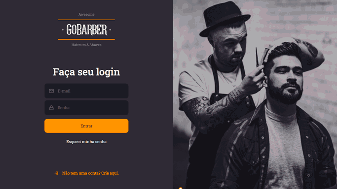

<p align="center">
  
</p>

<p align="center">
    
</p>

<p align="center">
  |&nbsp;&nbsp;&nbsp;
  <a href="#-technologies">Techs</a>&nbsp;&nbsp;&nbsp;|&nbsp;&nbsp;&nbsp;
  <a href="#-project">Project</a>&nbsp;&nbsp;&nbsp;|&nbsp;&nbsp;&nbsp;
  <a href="#-run">Run</a>&nbsp;&nbsp;&nbsp;|&nbsp;&nbsp;&nbsp;
  <a href="#-more">More</a>&nbsp;&nbsp;&nbsp;|&nbsp;&nbsp;&nbsp;
</p>

---

<p align="center">
  
</p>

## 👨‍💻 Technologies

This project was developed using the following technologies:

-   [NodeJS](https://nodejs.org/en/)
-   [Typescript](https://www.typescriptlang.org/)
-   [ReactJS](https://pt-br.reactjs.org/)
-   [Styled-components](https://styled-components.com/)

## 💻 Project

This is the GoBarber's front-end. Developed using Typescript and ReactJS, it consumes the [GoBarber API](https://github.com/lucasig11/gobarber-api) to authenticate, create new accounts, book new appointments and so on. I went a little further than the GoStack Bootcamp's original version and added a few more pages and implemented the appointment creation feature exposed by the server.

## 🚀 Run

```bash
git clone https://github.com/lucasig11/gobarber-web
cd gobarber-web

yarn

yarn start
```

---

Made with ♥ by [lucasig11](https://github.com/lucasig11) 👋🏻
